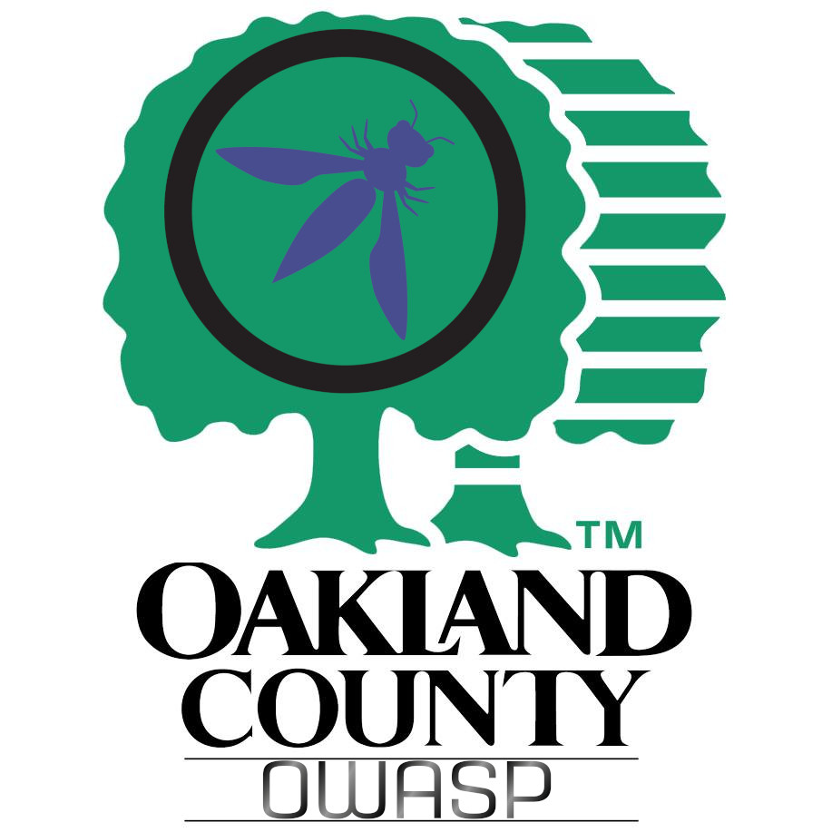

---

layout: col-sidebar

title: OWASP Oakland County, MI
tags: tags: participation-tag sponsorship-tag

level: 0

region: North America
meetup-group: OWASP-Oakland-County-Chapter
country: USA
postal-code: 48033

---

## Welcome

Welcome to the Oakland County (Michigan) chapter homepage. The Chapter Leaders are <a href="mailto:bradley.mcmahon@owasp.org">Brad McMahon</a> and <a href="mailto:steven.legg@owasp.org">Steven Legg</a>.

## Sponsers

We would like to thank the follow companies and orgnizations in all that they do to help us

<table class="sponsors-table">
    <tr>
        <td>  </td>
        <td>  </td>
    </tr>
</table>

## Meetings 

We have meetings The second Thursday of Febuary, May, August and November. 
https://www.meetup.com/OWASP-Oakland-County-Chapter/events

## Upcoming Events

**Title:** TBA  
**Presenter:**TBA  
**When:** Thursday, May 13, 2021 7PM  
**Where** Register on our meetup; page to get the zoom meeting link https://www.meetup.com/OWASP-Oakland-County-Chapter/events/277503002/ 

<blockquote>

</blockquote>

## PAST Meetings
### OWASP Oakland County Chapter Meeting ###
**Title:** Cloudy with a chance of Malware  
**Presenter:**Gavin Matthews @GavinThisThing  
**When:** Thursday, February 11, 2021 7PM  
**Where** Register on our meetup; page to get the zoom meeting link https://www.meetup.com/OWASP-Oakland-County-Chapter  

<blockquote>

</blockquote>

**Title:** API Tooling  
**Presenter:**Jean Yang @jeanqasaur  
**When:** Thursday, November 12, 2020 7PM  
**Where** Register on our meetup; page to get the zoom meeting link https://www.meetup.com/OWASP-Oakland-County-Chapter  

<blockquote>
 Why is it so hard to figure out if a 3-line change will bring down your site?
 Where do static analysis and network tools fall short?
 How can dynamic API models solve our problems?
  
  Join Jean at our OWASP talk and learn these answers adn more
</blockquote>

**Title:** Getting Better: Combating Darwinism in the Tech World  
**Presenter:*Nick Richardson  
**When:** Thursday, August 13, 2020 7PM  
**Where** Register on our meetup; page to get the zoom meeting link https://www.meetup.com/OWASP-Oakland-County-Chapter 

<blockquote>
Nick Richardson currently leads the Endpoint Engineering Teams at Duo Security, part of Cisco. He has over 17 years of tech experience across 6 companies, with 9 of those years in management. Prior to joining Duo he was the VP of Application Development for Amrock where he helped bring technology to the Mortgage and Title industry. He has a passion for building strong teams, learning about technology, and helping develop those around him so that they can be as successful as possible. 
</blockquote>

## Participation
The Open Web Application Security Project (OWASP) is a nonprofit foundation that works to improve the security of software. All of our projects ,tools, documents, forums, and chapters are free and open to anyone interested in improving application security. 

Chapters are led by local leaders in accordance with the [Chapter Leader Handbook](/www-policy/rules-of-procedure/chapter-handbook). Financial contributions should only be made online using the authorized online donation button. To be a SPEAKER at ANY OWASP Chapter in the world simply review the [speaker agreement](/www-policy/speaker-agreement) and then contact the local chapter leader with details of what OWASP Project, independent research, or related software security topic you would like to present.

Everyone is welcome and encouraged to participate in our [Projects](/projects), [Local Chapters](/chapters), [Events](/events), [Online Groups](https://groups.google.com/a/owasp.com/){:target='_blank'}, and [Community Slack Channel](https://owasp.slack.com/){:target='_blank'}. We especially encourage diversity in all our initiatives. OWASP is a fantastic place to learn about application security, to network, and even to build your reputation as an expert. We also encourage you to be [become a member](/membership) or consider a [donation](/donate) to support our ongoing work.

## Local News
- Meeting Location
- Everyone is welcome to join us at our chapter meetings.

